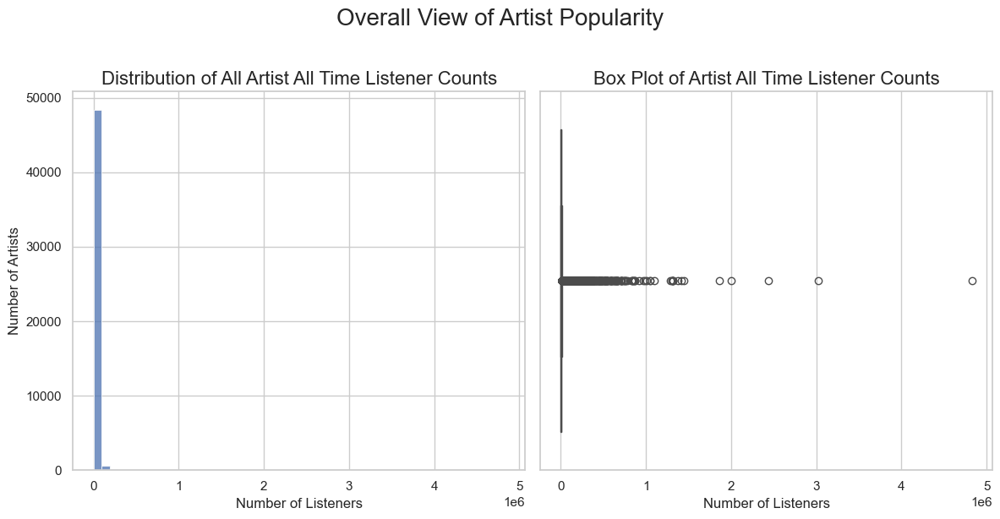
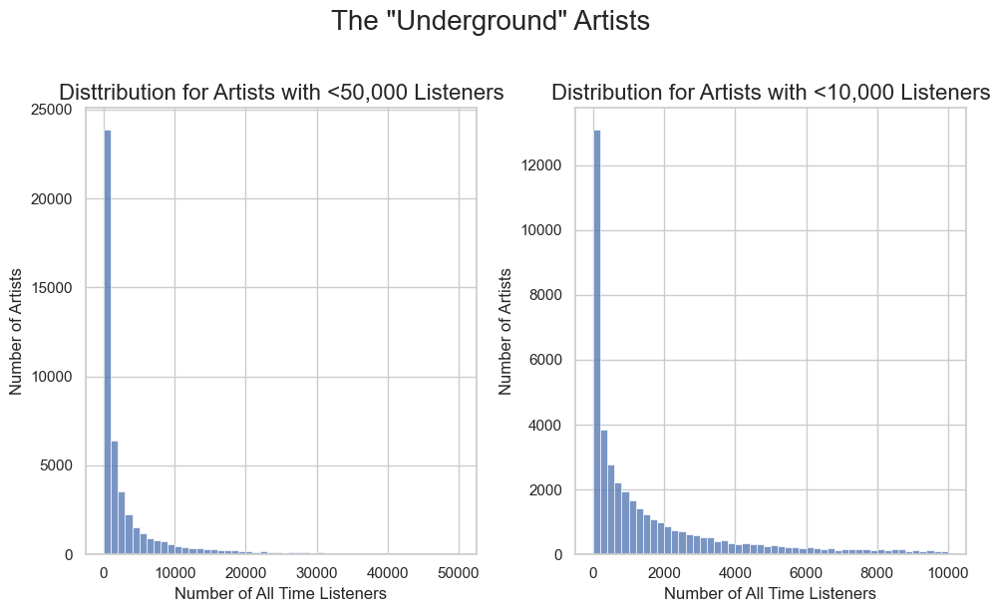
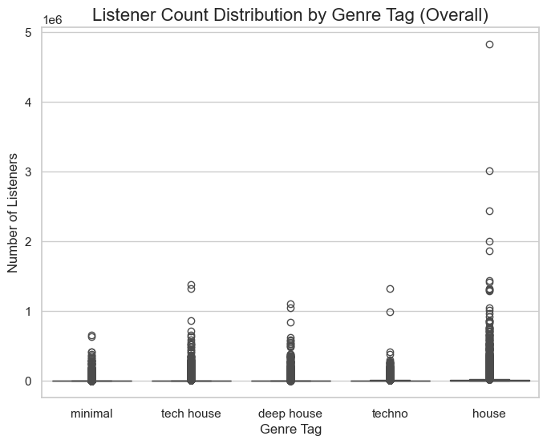
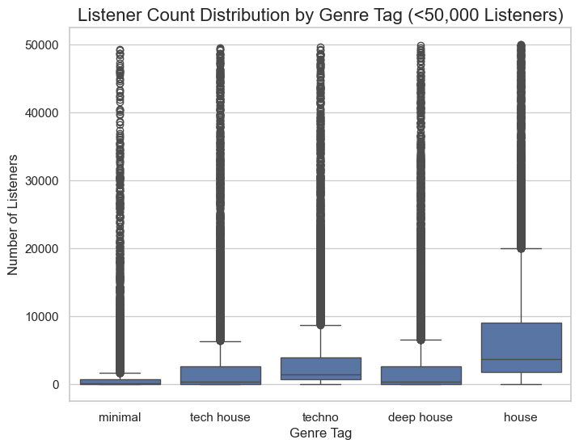
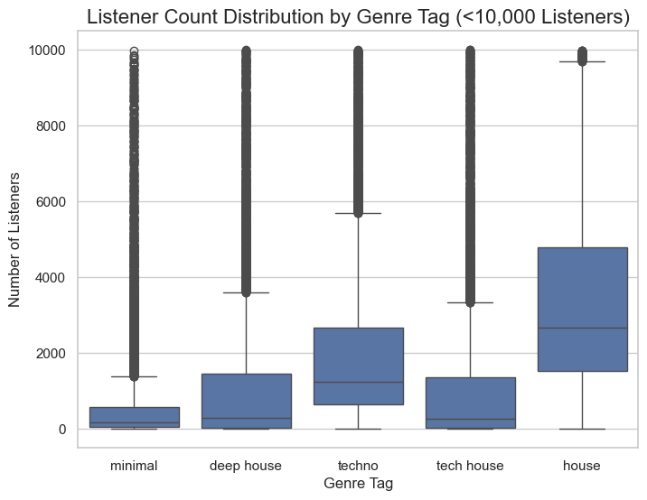

# 🚀 [Try the Underground House Music Discovery Engine!](https://underground-music-explorer.streamlit.app/)

# Underground Music Discovery Engine

## 🎯 Project Goal
To create a smart recommendation engine that helps users discover **underground electronic music**. The system provides a curated playlist that balances two key elements:

1.  **Relevance**: Tracks from artists similar to what the user already likes, providing a solid foundation of familiarity.
2.  **Discovery**: Hidden gems from unpopular ("underground") artists within the same genres, ensuring a fresh and exciting listening experience.

This hybrid approach delivers recommendations that are both perfectly tailored and full of surprises.

---

## 🌐 Live Demo
- **Play with the app here:** [underground-music-explorer.streamlit.app](https://underground-music-explorer.streamlit.app/)

---

## ⚙️ Tech Stack & References
- **Python** (core logic)
- **Streamlit** (web app framework)
- **Pandas** (data manipulation)
- **Requests** (API calls)
- **Matplotlib, Seaborn, Plotly** (visualizations)
- **Last.fm API** ([docs](https://www.last.fm/api))

---

## 📊 Key Findings from EDA

Exploratory Data Analysis (EDA) was performed to understand the landscape of electronic music artists and listeners. Here are some highlights:

- **Artist Popularity is Extremely Skewed:**  
  The vast majority of artists have very few listeners, while a small number of artists are extremely popular.

    
  *Left: Histogram of all artists by listener count (highly skewed). Right: Boxplot showing the same distribution.*

- **Zooming in on the Underground:**  
  Even when focusing on artists with fewer than 50,000 or 10,000 listeners, the distribution remains heavily skewed—most artists are truly underground.

    
  *Left: Histogram for artists with <50k listeners. Right: Histogram for artists with <10k listeners.*

- **Listener Count by Genre Tag:**  
  Some genres (like techno and house) have a wider range of artist popularity, but the skewness persists across all genres.

    
  *Boxplot: Listener count distribution for each genre tag (all artists).*

    
  *Boxplot: Listener count distribution for each genre tag (artists with <50k listeners).*

    
  *Boxplot: Listener count distribution for each genre tag (artists with <10k listeners).*

**Key Insights:**
- The definition of “underground” is robust: even at low listener thresholds, most artists remain obscure.
- Genre does not eliminate the skew—underground status is a consistent phenomenon across electronic music.

**Additional EDA Findings:**
- **Popularity varies significantly by genre:**
    - House is mainstream: House artists have dramatically higher mean and max listener counts than any other genre, reflecting its broad appeal and superstar presence. The 'house' tag is also very broad and ambiguous.
    - Minimal is the most "underground": The minimal tag has the lowest median listener count—50% of all minimal artists have fewer than 195 all-time listeners, making it a highly niche genre.
    - Techno & House are neighbors: Techno, deep house, and tech house occupy a middle ground, with techno being slightly more popular on average than deep house or tech house.
- **Every genre is skewed:**
    - The boxplots and the large differences between mean and median listener counts for every tag confirm a power-law distribution: every genre has a handful of superstars and a massive long tail of unknown artists.

---

## 📦 Data Collection from Last.fm
- **Artist Discovery:** Used Last.fm's `tag.getTopArtists` endpoint to fetch thousands of artists for each genre tag (e.g., 'techno', 'house').
- **Popularity Metric:** Queried each artist's total listener count using the `artist.getInfo` endpoint.
- **Genre Tagging:** Collected the top genre tags for each artist.
- **Underground Definition:** Artists with listener counts below the 75th percentile for their genre are considered "underground" in this project.
- **Data Storage:** All artist/tag/listener data is stored in `lastfm_artists_with_listeners.csv`.

---

## 🛠️ How the Data & Recommendations Work

### How do we build the artist database? (`get_artists_by_tag.py`)
This script is responsible for building the core artist database that powers the app:
1. **Finds artists by genre:** For each genre (like 'techno', 'house', etc.), it uses the Last.fm API to get a big list of artists.
2. **Removes duplicates:** Many artists appear under multiple genres. The script makes sure each artist is only counted once, but keeps track of all their genres.
3. **Gets popularity:** For every unique artist, it looks up their total number of listeners on Last.fm. This tells us how "underground" they are.
4. **Saves to CSV:** All this info—artist name, listener count, and genre(s)—is saved in a CSV file. This file is the foundation for all recommendations and analysis.

### How do we generate recommendations? (`get_recommendations.py`)
This script is the heart of the recommendation engine:
1. **Takes your favorite artist:** You enter an artist you like (the "seed").
2. **Finds similar artists:** It uses the Last.fm API to find artists similar to your seed artist, and gets their top tracks (these are likely to be familiar to you).
3. **Finds underground artists:** It also looks up other artists in the same genre(s) from the CSV database, but only those with low listener counts (the "underground" ones), and gets their top tracks (these are likely to be new discoveries).
4. **Mixes the results:** It combines tracks from both groups, removes any duplicates, and creates a playlist that balances familiar favorites with hidden gems.

**In summary:**
- `get_artists_by_tag.py` builds the big list of artists and their popularity.
- `get_recommendations.py` uses that list (plus real-time API data) to create a custom playlist for you, blending what you know with what you might love next.

---

## 📑 Data Dictionary: `lastfm_artists_with_listeners.csv`
| Column Name   | Description                                                      |
|--------------|------------------------------------------------------------------|
| artist_name  | Name of the artist                                               |
| tag          | Primary genre tag (e.g., 'techno', 'house')                      |
| listeners    | Total number of unique Last.fm listeners for the artist          |

---

## 🚦 Project Phases (Actual Workflow)
1. **Data Collection & EDA**
    - Gathered artist/tag/listener data from Last.fm.
    - Performed EDA to define "underground" and explore genre/listener distributions.
  
2. **EDA**
    - Understand the data we are working with and what it  means for an artist or track to be considered "underground".
3. **Recommendation Engine**
    - Developed hybrid logic to combine "relevance" (similar artists) and "discovery" (underground artists) paths.
4. **Web App Development**
    - Built a Streamlit app for user interaction, playlist generation, and data visualization.
5. **Deployment**
    - Deployed the app to Streamlit Community Cloud for public access.

---

## 🤝 Collaboration & Future Work
- Add user authentication for personalized scrobble-based recommendations.
- Integrate other APIs (Spotify, YouTube) for richer metadata and audio previews.
- Add machine learning for advanced track clustering and similarity scoring.
- Cache API results to speed up recommendations for frequent queries.

